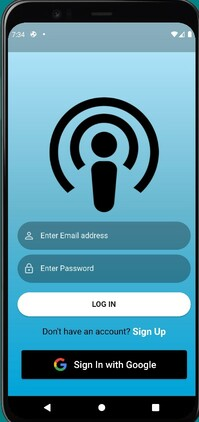
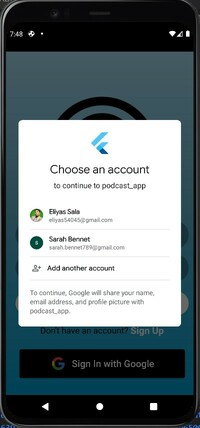
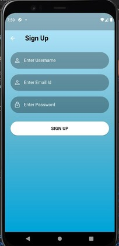
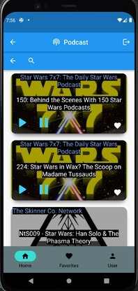
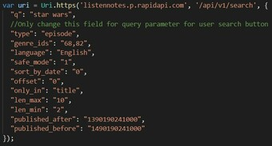

# Group Project: Podcast App

## Screenshots with brief overview
* Upon opening app, users are welcomed with this screen.
* Google Sign-in is available for authentication-based entrance into the app.

 

* Registeration through email and password creation is also available, along with logout functionality.
* Then, users are redirected to the homepage of the bottom navbar.
* The homepage allows users to view podcasts, episode detail, and play/pause recordings. Each returned card's UI can be improved in the "podcast_card.dart" file.

    

* Due to bugs under time constraints, I was unable to retrieve user inputs from textfield. However trivial this might seem, for some reason I kept getting no results with the api. I tried using a text controller then passing it to a variable to store and export the data to the api file with no avail. As seen below, the result is fetched from the "q" field of the parameter. 
* For future implementation, we could also create user interface to manipulate API filtering from the below fields. 

     
* Note: This is a paid API service, so I will discontinue it soon :(
